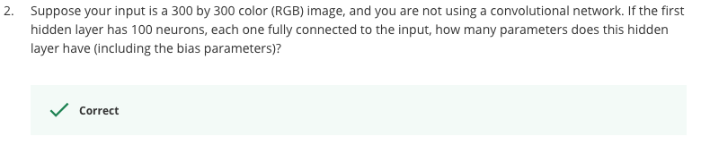
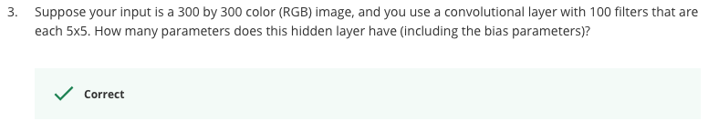
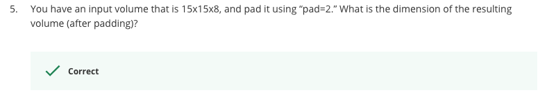
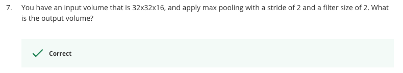
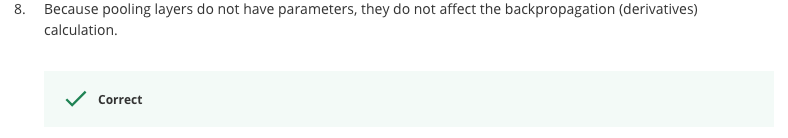

# Foundations of Convolutional Neural Networks Quiz

Question 1
----------

Question 2
----------

300 * 300 * 3 * 100 + 100 = 27.000.100

Question 3
----------

(5 * 5 * 3 + 1) * 100 = 7600

Question 4
----------

floor(((n + 2*p - f)/2) + 1)

floor(((63 + 2*0 - 7)/2) + 1)

floor(((56)/2) + 1)

floor(29)

29

and thus the output volume is 29 * 29 * 16

Question 5
----------

19 * 19 * 8 as we have "2" extra pixels on every side.

Question 6
----------

((n + 2*p - f) / s) + 1 = n

((63 + 2*p - 7) / 1) + 1 = 63

(63 + 2*p - 7) + 1 = 63

2*p - 7 + 1 = 0

2*p = 6

p = 6 / 2

p = 3

Question 7
----------

16 * 16 * 16

Question 8
----------

Question 9
----------

Question 10
----------
